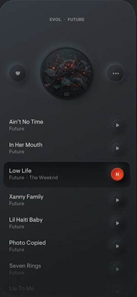
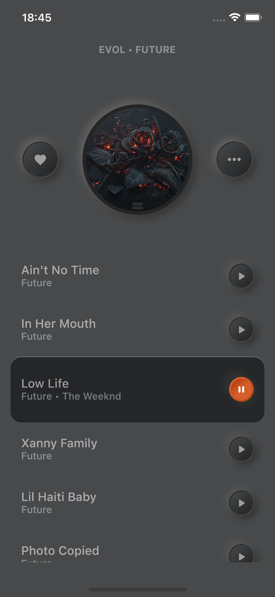
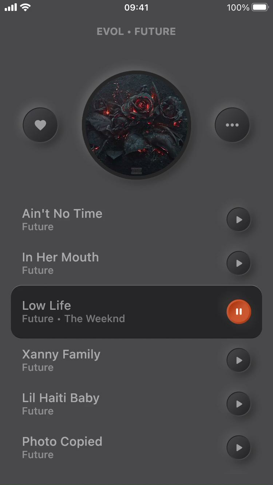
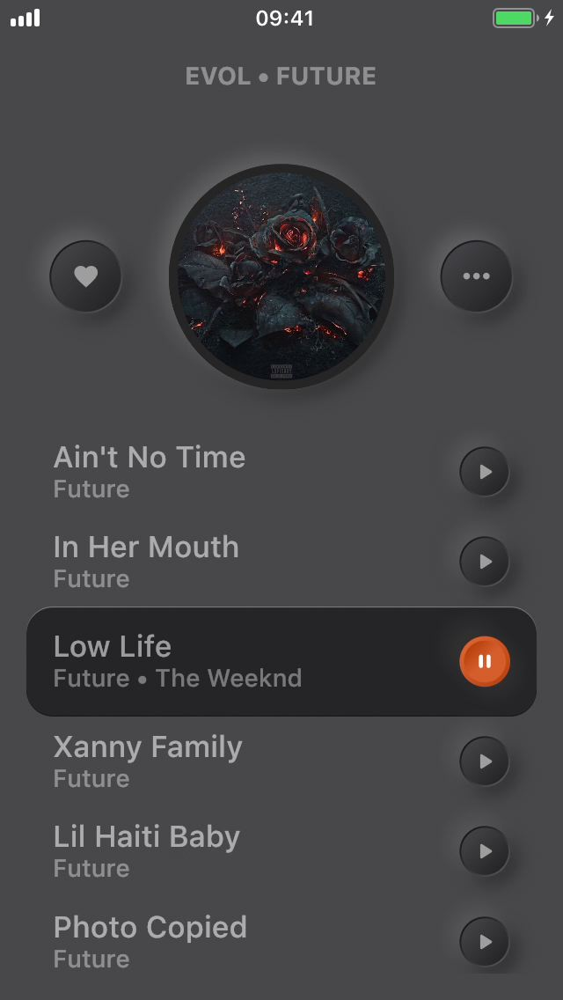
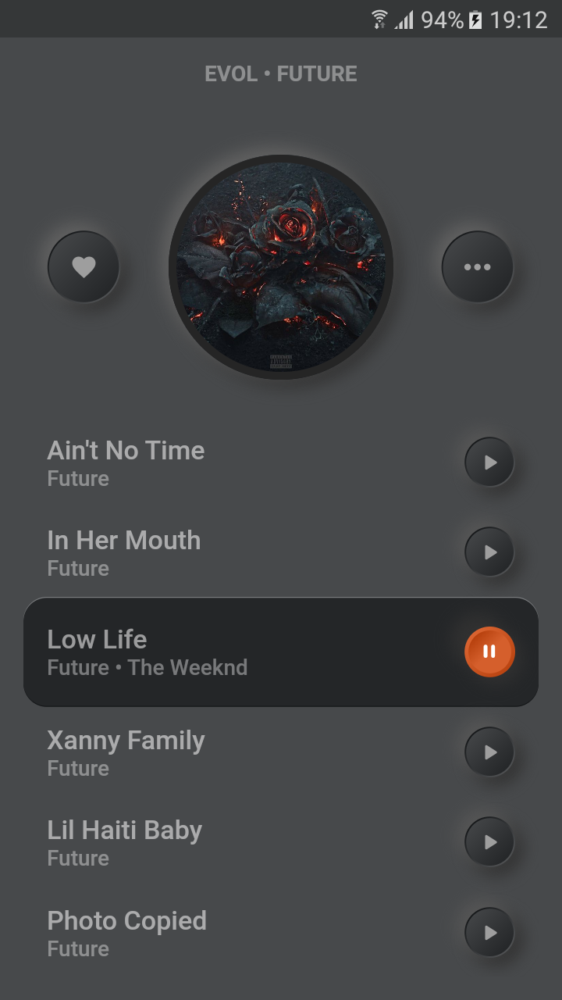

# Simple Music Player - reprodução de design neumórfico em Flutter

O neumorfismo é um estilo cujo objetivo é simular elementos 3D através da combinação de luz e sombras. Em outras palavras, é a tentativa de deixar objetos 2D o mais próximo possível de sua representatividade do mundo real.

Por exemplo, ao desenhar um botão, a aparência desse botão será muito parecido com o existente no mundo real, sobretudo em relação ao seu aspecto de profundidade. A sensação visual é a de que aquele botão é um objeto tangível.

Dependendo dos detalhes de implementação, é possível até mesmo simular o movimento de clique do botão ao realizar uma ação, seja usando o <strong>onTap</strong> ou o <strong>GestureDetector</strong>. 

O objetivo desse projeto é reproduzir o layout de um modelo neumórfico usando o Flutter, sem a utilização de nenhuma biblioteca específica para isso.

## Dependências

 - Flutter toolkit 3.0.2 (stable)
 - Dart 2.17.3
 - dart_code_metrics 4.15.2
 - flutter_lints: 2.0.0

## O modelo

O modelo a ser reproduzido é a segunda figura desse [projeto](https://dribbble.com/shots/9338617-Simple-Music-Player) retirado no dribbble.

O dribbble é uma plataforma onde designers podem submeter seus projetos de layouts para demonstrarem suas habilidades. 

É um repositório com um vasto cardápio de exemplos, com os mais diversificados tipos de aplicações para aqueles que pretendem desenvolver um produto e que precisam de alguma inspiração para a sua concepção visual.

## Imagens de comparação

As figuras abaixo ilustram um comparativo entre o modelo apresentado pelo dribbble e os resultados renderizados em diferentes plataformas e dispositivos, incluindo até mesmo o emulador de iPhone 13.

<table>
  <tr>
    <td>
      

        
      

      

        Modelo original do dribbble
      

    </td>
    <td>
      

        
      

      

        Emulador de iPhone 13 (iOS 15.5)
      

    </td>
    <td>
      

        
      

      

        iPhone 7 (iOS 15.5)
      

    </td>
  </tr>
  <tr>
    <td>
      

          
      

      

        iPhone 5 (iOS 12.5.5)
      

    </td>
    <td>
      

        
      

      

        Samsung J5 (Android 6.0.1)
      

    </td>
  </tr>
</table>